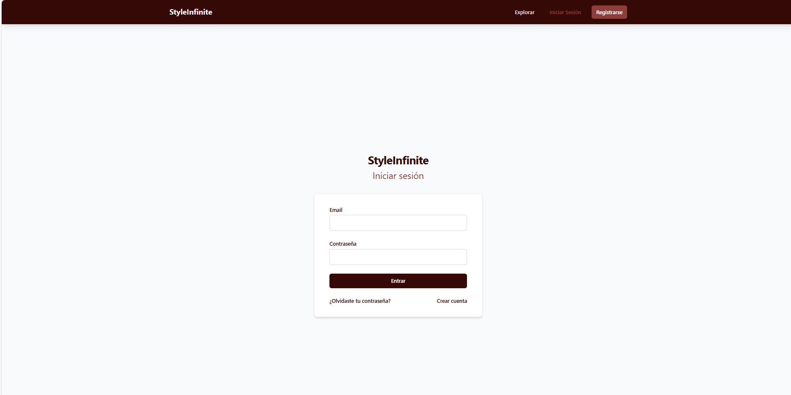

HU02 - Inicio de Sesión
=======================

**Como usuario de la aplicación**, quiero poder iniciar sesión con mi nombre de usuario y contraseña o con mi correo electrónico, para poder acceder a mi cuenta dentro de la aplicación.

Pasos del usuario
-----------------
1. Desde la pantalla principal, seleccionar **“Iniciar sesión”**.
2. Introducir:
   - Correo electrónico o nombre de usuario.
   - Contraseña.
3. Pulsar **“Entrar”**.

Criterios de aceptación
-----------------------
- Si las credenciales son incorrectas, debe mostrar un mensaje de error.
- Al iniciar sesión correctamente, se muestra la pantalla principal del usuario.
- Se debe mantener la sesión activa hasta que el usuario cierre sesión.

Captura sugerida
----------------

